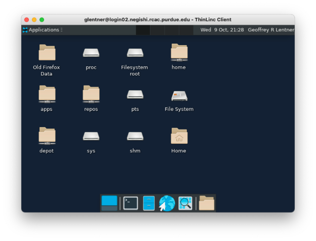
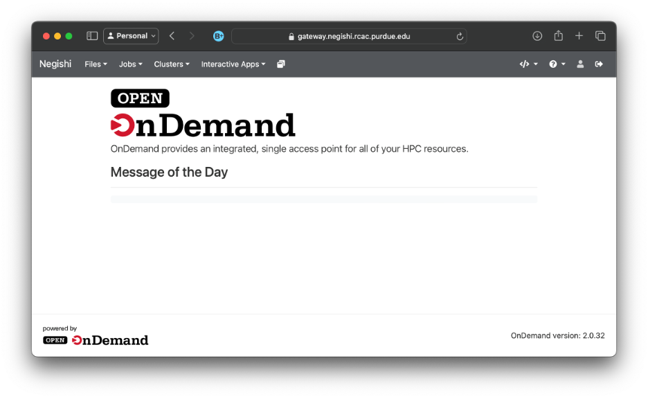

How to access the clusters
==========================
:doc:`week1`

**Previous section:**
:doc:`terminal`

In this section, we will talk about how to actually
access, or get onto the cluster(s).

There are three main ways to get onto the cluster(s):

#. ssh
#. ThinLinc
#. Open on Demand (gateway)

We will discuss each of these options and you can
choose which option(s) makes the most sense for you. 

**ssh**

`ssh` is the simplest way to access the cluster.
Most UNIX systems (such as Linux and macOS) have
the `ssh` program already installed. Windows 11
comes with the `ssh` program already there as
well. To use `ssh`, open a Terminal (in any system).
And use the command:

.. code-block::

   $ ssh USERNAME@CLUSTER.rcac.purdue.edu

Where `USERNAME` is replaced with your Purdue username
and `CLUSTER` is replaced with the cluster you are
trying to access.

You should see something that looks like this:

.. code-block::

   ************************************************************

   ***** Use of Purdue BoilerKey or SSH keys is Required ******

   ************************************************************

   (USERNAME@CLUSTER.rcac.purdue.edu) Password: 

Here you enter your Purdue password appended with a ',push'.
So you should enter in 'password,push'. It will not look like
anything is being typed. But the characters are being entered.
This is a security feature of `ssh` so that people don't know
how long your password is.

Once you enter your password and hit the enter key, it will
prompt a Duo push on your phone. Once you approve the Duo
push, you will be logged in (if you have been granted access
to the cluster you are trying to get into).

When you're logged in, you prompt should change to be of
the form of:

.. code-block::

   USERNAME@loginXX.CLUSTER:[~] $

You're now ready to do things on the cluster!

**ThinLinc**

ThinLinc is an alternative we provide if you would like
a more familiar GUI-based interface. There are two ways
to use ThinLinc: the browser version and the desktop
version. The desktop version requires a download, but
it has a couple more features that the browser version
doesn't have. Specifically, you can use ssh keys as
well as restart your session in the desktop version,
which you can't do in the browser version.

You can download the desktop ThinLinc client from Cendio
here: `Cendio <https://www.cendio.com/thinlinc/download/>`_

Otherwise, if you want to use the browser version,
simply open up your favorite internet browser and
navigate to `desktop.CLUSTER.rcac.purdue.edu`, where
`CLUSTER` is replaced with the name of the cluster
you want to access.

The desktop version of ThinLinc looks like this:

.. image:: /_static/TL_login.png
   :alt: Image showing the ThinLinc login portal, with text boxes to enter in the Server, the Username, and the path to the ssh key.

You may need to click the `Advanced` button to see
everything you need to.

The Server here is `desktop.CLUSTER.rcac.purdue.edu`, where 
`CLUSTER` is replaced with the name of the cluster
you want to access. The username is your Purdue username
and password is your Purdue password appended with ',push'.
That is, it would be 'password,push'. For the desktop version,
you will see one or two windows pop up that you just need to
click through and then it will prompt two Duo pushes, that
you need to approve. After you're logged in, you'll see
something that looks like this:

Use ThinLinc, either the browser or desktop version, if
you want to run any kind of graphical application, like
Matlab for example.

ThinLinc is also nice that the sessions are persistent,
it will hold onto your applications and running shells
unless you don't log in for 2 weeks.

**Open on Demand**

Open on Demand, also known as the Gateway, is a modern web
interace to our HPC resources. You don't need to open a
terminal, or understand a UNIX command-line shell. Although,
you can open a shell from it. You can check/edit files and
organize your data through the web interface. You can even
request interactive compute sessions with apps such as
Jupyter, RStudio, Matlab, etc.

To log in to Open on Demand, open your internet browser and
navigate to `gateway.CLUSTER.rcac.purdue.edu`, where `CLUSTER`
is again replaced with the name of the cluster you are
trying to access. After you log in through Purdue's normal
Single Sign On page, you should see something like this:

Next section\:
:doc:`unix`

