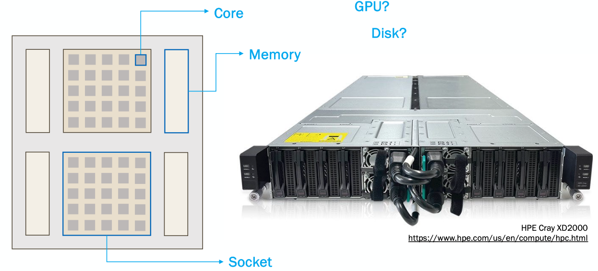

What is a cluster?
==================
:doc:`week2`

**Previous section:**
:doc:`applications`

Since we've now learned how to interact with
the cluster and run programs on it, what
actually is a cluster? A cluster is built from
many **servers**, which are **interconnected**
over fast networks, attached to one or more
**data** storage systems. They typically run
a **UNIX**-like operating system and are
managed by a batch **scheduler**. They often
run special **software**.

So what are these servers that make up the
clusters? They're all just computers! They
look a certain way and live in a data center
so they are technically servers, but when
referring to a single server as a unit within
a cluster of machines, **node** suggests
membership in a group. They have many names,
such as: node, computer, server, machine, host.

Different nodes can also have different
purposes, such as **login** vs. **compute**
vs. **data**. We will get into this distinction
more later in this section.

Here is what a node looks like and what it is
made up of:

Each node has one or more sockets that are each
made up of a number of cores. Each socket has its
own memory associated with it. There are many other
components that can make up a node, such as disk
space, or GPUs.

Most clusters are broken up into two main parts:
the front end or login nodes and the compute or
back end nodes. When you log into the cluster,
you are put onto a login node, which is limited
in resources and not suitable for doing actual
research. You need to interact with the scheduler
(which we will talk about in the next section
:doc:`jobs`) to move from the login nodes to the
compute nodes.

Before we get started with how to do that,
we should talk about the two paradigms of
running code on a supercomputer:

* Interactively
* Batch mode

In the interactive paradigm, you get a session
on a compute node (using the gateway, ssh, or
ThinLinc), and the run your code directly.
However, if your network drops, your code
could be interrupted.

In the batch paradigm, you write your code,
and then submit one (or many) instances of
your code using the scheduler and it can
run on arbitrarily many nodes without worry
of interruption.

Next section\:
:doc:`jobs`

