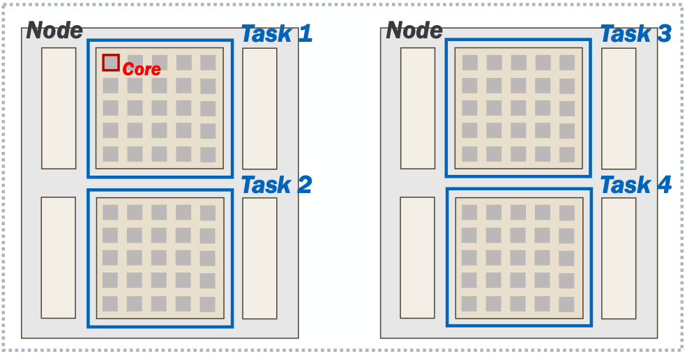

Multinode jobs and topology
===========================
:doc:`week4`

**Previous section:**
:doc:`files2`

In jobs, you can also request jobs
that span over two or more nodes,
these are called **multinode** jobs
and have special things to consider
when running them.

You can request jobs that have different
"shapes", such as the layout of the
following command::

   sbatch -N2 --ntasks-per-node=2 --cpus-per-task=64...

Here, the job encompasses two nodes, with
two tasks on each node, and 64 cores
assigned to each task. The layout looks
like this:

As mentioned earlier, the `hostname`
program prints out the hostname of the
server we are currently on.

The `srun` launcher is part of Slurm and
will bring up copies of your program
within the allocation according to the
number of tasks in your request.

Submit the following job script (or
variations of it) to get a sense of
how we can launch copies of a program
across an allocation. Name the job
script `hostname.sh`

.. code-block::

   #!/bin/bash
   #SBATCH -A lab_queue -p cpu -q standby
   #SBATCH -N2 --ntasks-per-node=2 --cpus-per-task=64
   #SBATCH -t 00:10:00
   
   srun hostname

Distributed workflows rely on application
*instances* working together between nodes.

Submit your job to the scheduler using
the `sbatch` program::

   $ sbatch hostname.sh
   Submitted batch job 19804935

You can check on the job status using
the command `squeue --me`::

   $ squeue --me
   JOBID      USER         ACCOUNT     NAME          NODES   CPUS  TIME_LIMIT ST TIME
   19804935   username   lab_queue     hostname.sh       2    256    00:10:00 PD 00:00

Remember that the job ID will be used
for the output filename (e.g.
`slurm-19804935.out`). You can use
the `cat` program to show the output
stored in the file::

   $ cat slurm-19804935.out
   a200.negishi.rcac.purdue.edu
   a200.negishi.rcac.purdue.edu
   a209.negishi.rcac.purdue.edu
   a209.negishi.rcac.purdue.edu

What did you notice in the output file
of this job? Do the hostnames align with
what you expected based on the request?
How would we capture the output of each
of these tasks (job steps) separately?

.. admonition:: Answer
   :collapsible: closed

   We could use `srun`'s `--output`
   option e.g.:

   `--output %j-%t-%s.out`

   Where `%j` is the job ID, `%t` is the
   task ID and `%s` is the step ID.

We cannot go too deep into the nuances of
distributed software development or
MPI-based applications in this workshop.
It is still important to understand that
your job script does
**not automatically start running on other nodes in your job.**

But, we've learned that it is *possible*
to orchestrate multiple tasks in
parallel across nodes. More on this in
this week's session: :doc:`workloads`.

Next section\:
:doc:`history`

